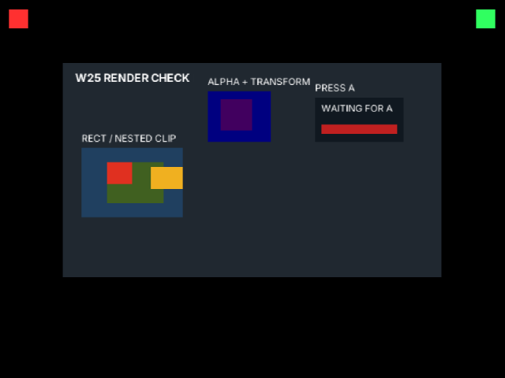
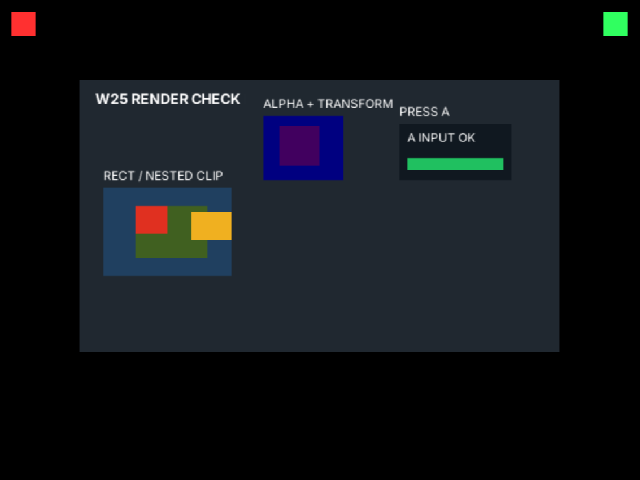

# W25 Wii renderer fixture

This static `wii-dev` ABI 7 guest exercises **rectangles, nested clipping, transformed alpha images, baked glyphs, and Wii Remote A input**. Its first frame is deterministic; pressing A changes only the indicator.

## Build and package

From the repository root:

```sh
bun tools/wii.ts w25-renderer-fixture
make -C hosts/wii/core/admission-check desktop \
  SOURCE="$PWD/dist/wii/guest/w25-renderer-fixture.pocket" \
  WORK=/tmp/pocketjs-wii-w25-admission
PATH=/opt/devkitpro/devkitPPC/bin:/opt/devkitpro/tools/bin:$PATH \
DEVKITPRO=/opt/devkitpro DEVKITPPC=/opt/devkitpro/devkitPPC \
make -B -C hosts/wii/example \
  GUEST_PACKAGE="$PWD/dist/wii/guest/w25-renderer-fixture.pocket" \
  BUILD=/tmp/pocketjs-wii-w25-example V=1
```

The guest package is `dist/wii/guest/w25-renderer-fixture.pocket`. The external example build emits `/tmp/pocketjs-wii-w25-example/boot.dol` and draws the 480×272 guest at `(80,80)` in its 640×480 EFB.

## Capture and normalize

The checked-in evidence was captured in Dolphin Vulkan with a fresh profile. Set `[Wiimote1] Source = 1` in `Dolphin.ini`; the profile's `WiimoteNew.ini` maps `XInput2/0/Virtual core pointer` click 1 to A. `grim` captures the scaled render window, **not** a 640×480 EFB. For a comparable direct check, crop the measured EFB rectangle and resize it to exactly 640×480 before running the checker:

```sh
timeout --signal=TERM --kill-after=5s 180s dolphin-emu \
  --user=/tmp/pocketjs-w25-fixture-fresh --video_backend=Vulkan \
  --exec=/tmp/pocketjs-wii-w25-example/boot.dol \
  -C Logger.Logs.OSREPORT=True -C Logger.Options.WriteToConsole=True
grim -T 18000130 /tmp/pocketjs-w25-fixture-before-a.png
# Before capture: do not send input. Then XWarpPointer to renderer XID 0xa0000f,
# position (320,174); XTestFakeButtonEvent(1, press); wait 150 ms; release.
# Capture this second state after the release.
grim -T 18000130 /tmp/pocketjs-w25-fixture-after-a.png
for state in before-a after-a; do
  magick "/tmp/pocketjs-w25-fixture-${state}.png" \
    -crop 1133x699+74+0 +repage -filter Point -resize 640x480! \
    "hosts/wii/check/w25/evidence/${state}.png"
done
bun hosts/wii/check/w25/check.ts hosts/wii/check/w25/evidence/before-a.png
bun hosts/wii/check/w25/check.ts hosts/wii/check/w25/evidence/after-a.png --cross
```

The crop `(74,0,1133,699)` is the full EFB rectangle measured in the 1278×699 `grim` image. The checker accepts that original window image with `--crop=74,0,1133,699`, but requires exactly 640×480 when no crop is supplied. Do not pass a guest-only crop to the checker.

Both normalized captures passed all 10 samples. All flat-color samples matched exactly. The glyph sample was `#fbfbfb` against white within ±8; the alpha formula predicts `#400060`, while the captured sample is `#41005f` (red +1, blue −1; allowed ±4 per channel). Before input, the indicator is `#c02020`; after one Wii Remote A press it is `#20c060`.

| Sample | Guest coordinate | Expected RGB | Operation |
| --- | ---: | --- | --- |
| Outer rect | `(32,116)` | `#204060` | Rect; active outer clip |
| Hidden overflow | `(52,140)` | `#204060` | Nested clip blocks red child |
| Red child | `(64,134)` | `#e03020` | Inner clip and painter order |
| Inner fill | `(110,164)` | `#406020` | Nested rect |
| Sibling after inner clip | `(140,145)` | `#f0b020` | Clip pop restores outer clip |
| Beyond outer clip | `(156,145)` | `#202830` | Outer clip remains active |
| Image origin | `(198,64)` | `#000080` | Translated/scaled image boundary |
| Transformed alpha image | `(238,64)` | about `#400060` (±4/channel) | Scale, texture alpha 128, node opacity 0.5 |
| Baked glyph | `(25,22)` | white (±8/channel) | Text rasterization |
| Input indicator | `(376,84)` | `#c02020` before; `#20c060` after A | `BTN.CROSS` input |

The alpha texture is a uniform 2×2 RGBA image, so the sample is away from its edge. The glyph sample is a bright interior pixel of the white `W25 RENDER CHECK` label.

| Before A | After Wii Remote A |
| --- | --- |
|  |  |

## Hero screenshot and accepted golden differences

The separate current hero capture below was cropped to its guest viewport and resized to 480×272. Compare it with the [Web frame 80 golden](../../../../tests/goldens/web/hero-main.80.png); the other comparison frames are [frame 2](../../../../tests/goldens/web/hero-main.2.png) and [frame 10](../../../../tests/goldens/web/hero-main.10.png).


The current arcade logo in [`assets/images/logo.png`](../../../../assets/images/logo.png) differs from the old blue gradient/play icon stored in those Web goldens; that source-art change affects the logo pixels. This hero capture was taken at an arbitrary live frame without replaying the golden input tape, so its count is 0 instead of frame 80's 5, and the spinner phase and underline tween position differ. Outside the logo and spinner, the resampled viewport mean absolute error against frames 2, 10, and 80 is 4.2, 4.6, and 4.8 RGB levels. These are accepted capture/golden differences; the fixture samples above cover deterministic renderer operations directly.
